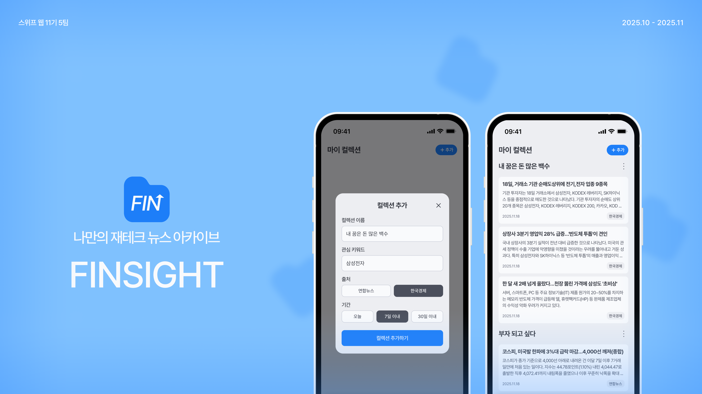
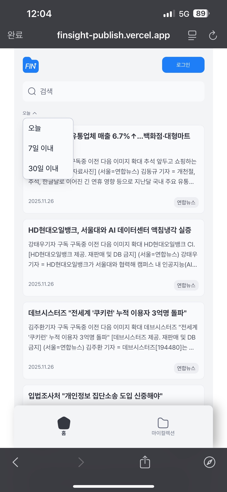
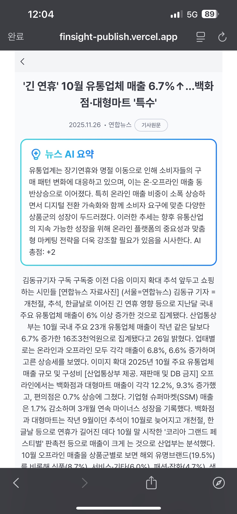
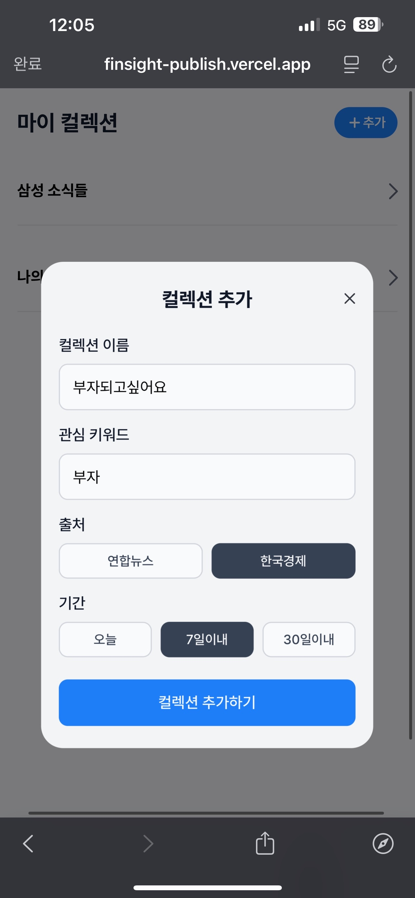
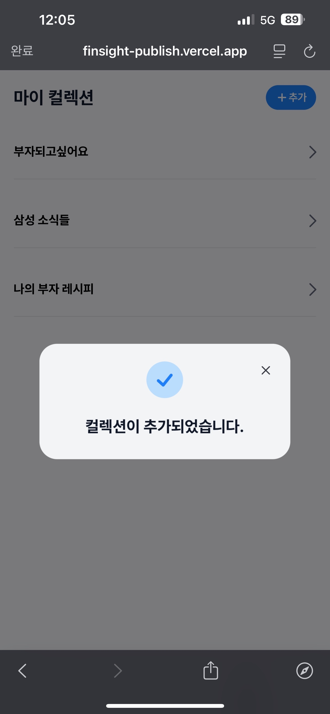
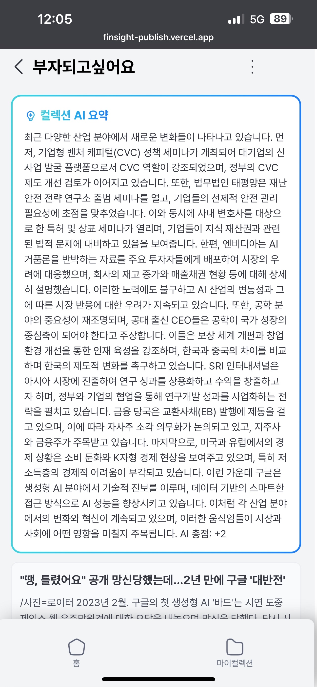
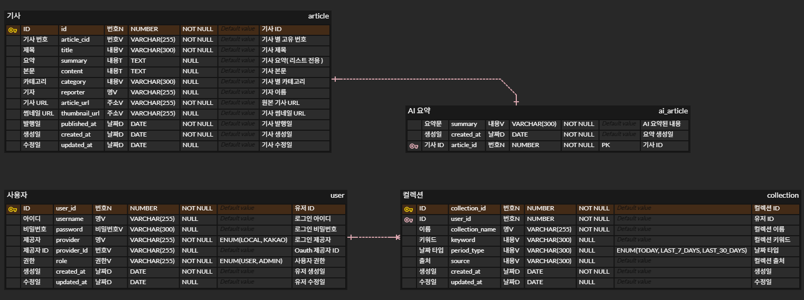
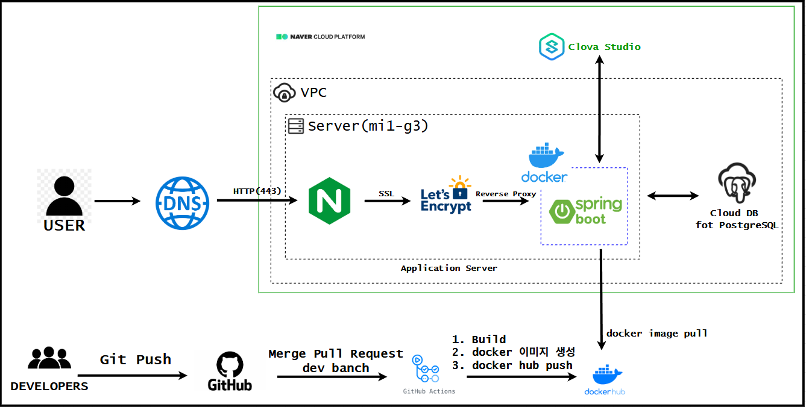

## 📑 목차
1. [프로젝트 소개](#-핀사이트-finsight)
2. [프로젝트 개요](#-프로젝트-개요)
3. [주요 기능](#-주요-기능)
4. [데이터베이스 ERD](#-데이터베이스-ERD)
5. [팀원 소개](#-팀원-소개)

## 📰 핀사이트 (Finsight)
### 스위프 웹 11기 - 5팀: 재태크 관련 개인 맞춤형 뉴스 기사 콜렉터
내가 관심있어 하는 정보, 나의 자산과 직접적인 관련이 있는 금융 정보들만 놓치지 않고 따끈따끈하게 소화하고 싶지 않으신가요?<br>
FINsight와 함께라면 간단한 키워드 설정만으로 나에게 꼭 필요한, 최신의 투자 관련 뉴스들을 하나의 플랫폼에서 모두 받아보세요!

## ✨ 프로젝트 개요
###  개발 기간: 25.10 ~ 25.11
###  개발 인원: 7명(PM 1명, PD(디자이너) 1명, FE 2명, BE 3명)
###  배포 url: https://finsight-publish.vercel.app/
###  API 명세서: [Finsight REST API Swagger](http://175.106.99.96:8080/swagger-ui/index.html)

해당 프로젝트는 핀사이트(Finsight) 서비스의 백엔드 시스템을 구축한 개인/팀 프로젝트로, 안정적인 API 제공, 유연한 확장성, 운영 편의성을 목표로 설계되었습니다.

### 📹 [시연 영상](https://drive.google.com/file/d/1nd-KBvB9GmLw1KwVWOmDVQSmhXiY1eGg/view?usp=sharing) 
여기에 영상 들어갈 예정

### 📄 [발표 자료](https://docs.google.com/presentation/d/1ewIp6Ewz8a023O6pvgxxVSg6ij-5F7TX/edit?usp=drive_link&ouid=102263935085836178064&rtpof=true&sd=true)
여기에 피피티 들어갈 예정

---
## 주요 기능
| 기능 1                               | 기능 2                               |
|------------------------------------|------------------------------------|
|  |  |
| 기사 클롤링                             | 기사 AI 요약                           |

| 기능 3                               | 기능 4                               | 기능 5                               |
|------------------------------------|------------------------------------|------------------------------------|
|  |  |  |
| 마이컬렉션 추가                           | 마이컬렉션 추가 성공                        | 나만의 기사 모음 요약                       |

- 비로그인(마이컬렉션 사용 불가) / 로그인 기능 분리
- 스케줄러 기반 자동 웹 크롤링
- 다수 / 단일 기사 AI 요약 기능 제공

---
## 🛠 기술 스택

<div align="center">

### Backend


### Database & Cache


### Infrastructure & DevOps


### Monitoring


### Tools & Libraries


### Development Tools


### Collaboration


</div>

---
## DB / ERD 구조


---
## 시스템 아키텍쳐


---
## 🤔 기술적 의사 결정

<details>
<summary><b>왜 JWT가 아닌 Session 기반 인증을 선택했는가?</b></summary>

### 📌 배경 및 문제 상황
로그인 인증 방식을 선택하는 과정에서 JWT와 Session 방식 중 어떤 것을 사용할지 고민하게 되었습니다.

### ✅ 선택한 방식: Session 기반 인증

**우리 프로젝트는 단일 인스턴스 환경**에서 운영되기 때문에 Session 방식을 선택했습니다.

### 💡 단일 인스턴스에서 Session이 더 적합한 이유

#### 1️⃣ **즉시 세션 무효화 가능**
- Session: 서버에서 세션을 삭제하면 **즉시 인증 무효화**
- JWT: 토큰이 만료될 때까지 무효화 불가능 (블랙리스트 관리 필요)

#### 2️⃣ **서버 측 제어 가능**
- Session: 서버가 모든 세션 정보를 관리하므로 **실시간 제어** 가능
- JWT: 클라이언트가 토큰을 보관하므로 서버에서 직접 제어 불가

#### 3️⃣ **보안성**
- Session: 세션 ID만 클라이언트에 저장 (민감 정보는 서버에 보관)
- JWT: 토큰에 사용자 정보가 포함되어 있어 탈취 시 위험

#### 4️⃣ **단일 인스턴스 환경의 장점 활용**
- 별도의 Redis나 세션 스토리지 없이 **메모리 내 세션 관리 가능**
- 네트워크 오버헤드 없이 빠른 세션 조회

### 📊 JWT vs Session 비교

| 구분 | Session | JWT |
|------|---------|-----|
| **저장 위치** | 서버 메모리/DB | 클라이언트 |
| **무효화** | 즉시 가능 | 어려움 (만료 시간까지 유효) |
| **확장성** | 단일 서버에 유리 | 분산 환경에 유리 |
| **서버 부하** | 세션 저장 공간 필요 | Stateless (서버 부하 적음) |
| **보안** | 서버에서 관리 | 토큰 탈취 시 위험 |
| **구현 복잡도** | 간단 | Refresh Token 등 추가 로직 필요 |

### 🎯 언제 Session을 쓰고, 언제 JWT를 써야 할까?

#### Session을 사용해야 하는 경우
- ✅ **단일 서버 환경**
- ✅ 즉시 로그아웃/세션 무효화가 중요한 경우
- ✅ 민감한 정보를 다루는 서비스 (금융, 결제 등)
- ✅ 서버에서 사용자 세션을 실시간으로 관리해야 하는 경우

#### JWT를 사용해야 하는 경우
- ✅ **다중 서버 환경 (MSA, 로드밸런싱)**
- ✅ Stateless 아키텍처를 유지하고 싶은 경우
- ✅ 모바일 앱처럼 장기간 인증을 유지해야 하는 경우
- ✅ 외부 API 인증이 필요한 경우

### 🚀 결론
우리 프로젝트는 **단일 인스턴스 환경**이기 때문에, 즉시 세션 무효화가 가능하고 보안성이 높은 **Session 방식**이 더 적합하다고 판단했습니다.

만약 향후 서비스가 확장되어 다중 서버 환경으로 전환된다면, Redis와 같은 **중앙 세션 스토리지(REdis)**를 도입하거나 JWT 방식으로 전환하는 것을 고려할 수 있습니다.

</details>

<details>
<summary><b>왜 NCP SSL 인증서가 아닌 Nginx + Let's Encrypt를 선택했는가?</b></summary>

### 📌 배경 및 문제 상황
HTTPS 적용을 위해 SSL 인증서가 필요했고, NCP에서 제공하는 SSL 인증서와 Nginx를 통한 Let's Encrypt 인증서 중 선택해야 했습니다.

**NCP Certificate Manager에서 무료로 SSL 인증서를 발급받을 수 있지만, Load Balancer나 CDN+와 같은 NCP 서비스와 연동해야만 사용할 수 있습니다.** 즉, SSL 인증서 자체는 무료지만 로드밸런서가 필수입니다.

### ✅ 선택한 방식: Nginx + Let's Encrypt

**서버에 직접 Nginx를 설치하고 Let's Encrypt로 SSL 인증서를 발급**받는 방식을 선택했습니다.

### 💡 Nginx + Let's Encrypt를 선택한 이유

#### 1️⃣ **단일 인스턴스 환경에서 로드밸런서는 불필요**
- 우리 프로젝트는 **단일 서버 환경**
- 로드밸런서는 여러 서버에 트래픽을 분산하기 위한 것인데, 서버가 1대뿐이라면 **오버스펙**
- 불필요한 네트워크 홉(hop)만 추가되어 **응답 속도 저하** 가능

#### 2️⃣ **비용 절감**
```
NCP Certificate Manager 방식:
- SSL 인증서: 무료 ✅
- BUT, 로드밸런서 필수:
  → 로드밸런서: 시간당 26원 = 월 18,720원
  → 공인 IP: 시간당 5.6원 = 월 4,032원
  → 총 월 22,752원 (VAT 별도)
→ 연간 비용: 273,024원 (VAT 별도)
→ VAT 포함 시: 약 300,326원

Nginx + Let's Encrypt:
- Nginx 설치: 무료
- Let's Encrypt 인증서: 무료
- 로드밸런서 불필요
→ 총 비용: 0원
```
💰 **연간 약 30만원의 비용 절감 효과**

#### 3️⃣ **자동 갱신 가능**
```bash
# Certbot을 통한 자동 갱신 설정
certbot renew --dry-run
```
- Let's Encrypt는 **90일마다 자동 갱신** 가능
- Certbot으로 갱신 자동화 설정이 간단함
- NCP Certificate Manager도 자동 갱신을 지원하지만 로드밸런서 비용은 계속 발생

#### 4️⃣ **서버에 대한 완전한 제어권**
- Nginx 설정을 통해 **리버스 프록시, 캐싱, Gzip 압축** 등 추가 기능 구현 가능
- SSL/TLS 버전, 암호화 알고리즘 등 세부 설정 직접 관리 가능
```nginx
# Nginx에서 직접 SSL 설정 가능
ssl_protocols TLSv1.2 TLSv1.3;
ssl_ciphers HIGH:!aNULL:!MD5;
```

#### 5️⃣ **아키텍처 단순화**
```
NCP Certificate Manager 방식:
클라이언트 → 로드밸런서 (SSL 종료) → 서버
(불필요한 네트워크 레이어)

Nginx 방식:
클라이언트 → 서버 (Nginx에서 SSL 처리)
(단순하고 직관적)
```

#### 6️⃣ **서비스 제약 없음**
- NCP Certificate Manager는 **Load Balancer나 CDN+와 연동해야만 사용 가능**
- 서버에 직접 설치하는 방식은 불가능
- Nginx + Let's Encrypt는 **어떤 환경에서도 독립적으로 사용 가능**

#### 7️⃣ **클라우드 벤더 종속성 감소**
- NCP Certificate Manager를 사용하면 NCP 플랫폼에 강하게 종속됨
- Nginx + Let's Encrypt는 **어떤 서버 환경에서도 동일하게 적용 가능**
- 향후 AWS, GCP 등 다른 클라우드로 마이그레이션 시 유리

### 📊 NCP Certificate Manager + 로드밸런서 vs Nginx + Let's Encrypt 비교

| 구분 | NCP Certificate Manager + 로드밸런서 | Nginx + Let's Encrypt |
|------|---------|----------------------|
| **SSL 인증서** | 무료 | 무료 |
| **로드밸런서** | 필수 (월 22,752원) | 불필요 |
| **연간 총 비용** | 약 30만원 (VAT 포함) | 0원 |
| **아키텍처** | 클라이언트 → LB → 서버 | 클라이언트 → 서버 |
| **단일 서버 적합성** | ❌ 오버스펙 | ✅ 최적 |
| **서버 직접 설치** | ❌ 불가능 (LB 필수) | ✅ 가능 |
| **갱신** | 자동 갱신 | 자동 갱신 |
| **설정 자유도** | 제한적 | 높음 (직접 제어 가능) |
| **확장성** | NCP 환경에 종속 | 모든 환경에서 사용 가능 |
| **추가 기능** | SSL + 부하 분산 | 리버스 프록시, 캐싱, 압축 등 |
| **학습 효과** | 낮음 (관리형 서비스) | 높음 (직접 구축 경험) |

### 🎯 언제 NCP Certificate Manager를 쓰고, 언제 Nginx + Let's Encrypt를 써야 할까?

#### NCP Certificate Manager + 로드밸런서를 사용해야 하는 경우
- ✅ **다중 서버 환경**에서 트래픽 분산이 필요한 경우
- ✅ Auto Scaling을 통해 서버를 동적으로 추가/제거하는 경우
- ✅ CDN+와 연동하여 정적 컨텐츠 배포가 필요한 경우
- ✅ NCP 생태계 내에서만 운영하며 관리형 서비스를 선호하는 경우
- ✅ 서버 직접 관리 리소스가 부족한 경우

#### Nginx + Let's Encrypt를 사용해야 하는 경우
- ✅ **단일 서버 환경** (우리 프로젝트처럼)
- ✅ **비용 절감**이 중요한 경우 (스타트업, 개인 프로젝트)
- ✅ 서버 설정에 대한 **완전한 제어권**이 필요한 경우
- ✅ 클라우드 **벤더 종속성을 피하고 싶은** 경우
- ✅ 로드밸런서 없이 **서버에 직접 SSL을 적용**하고 싶은 경우
- ✅ **학습 및 실무 경험**을 쌓고 싶은 경우

### 🚀 결론
우리 프로젝트는 **단일 서버 환경**이기 때문에 로드밸런서를 도입하는 것은 불필요한 비용과 복잡도만 증가시킵니다.

NCP Certificate Manager는 SSL 인증서 자체는 무료로 제공하지만, **Load Balancer나 CDN+와의 연동이 필수**라는 제약이 있습니다. 단일 서버 환경에서는 이러한 서비스가 불필요하므로, 로드밸런서 비용(연간 약 30만원)이 추가로 발생하게 됩니다.

**Nginx + Let's Encrypt** 방식을 선택함으로써:
- ✅ **연간 약 30만원의 비용 절감** (로드밸런서 + 공인 IP 비용)
- ✅ 불필요한 네트워크 레이어 제거로 **응답 속도 개선**
- ✅ **아키텍처 단순화**로 유지보수 용이
- ✅ **서버에 직접 SSL 설치** 가능 (로드밸런서 불필요)
- ✅ 향후 확장 시에도 유연하게 대응 가능

특히 Let's Encrypt의 **자동 갱신 기능**으로 인증서 관리 부담도 최소화할 수 있었고, 어떤 클라우드 환경으로 이전하더라도 동일한 방식을 적용할 수 있어 **플랫폼 독립성**을 유지할 수 있다는 점도 큰 장점이었습니다.

만약 향후 트래픽이 증가하여 **다중 서버 환경**으로 확장된다면, 그때 NCP의 로드밸런서와 Certificate Manager를 함께 도입하는 것을 고려할 수 있습니다.

</details>

<details>
<summary><b>왜 외부 라이브러리 대신 인메모리 캐시를 선택했는가?</b></summary>

### 📌 환경 조건: 단일 인스턴스 서버 + 최소 의존성
프로젝트는 단일 서버에서 동작하며, 캐싱 기능은 한 곳에서만 사용됩니다.  
따라서 기능을 구현할 때 **추가 라이브러리를 도입하기보다는, 기존 기능과 자바 표준 도구를 최대한 활용**하는 것이 합리적이었습니다.

### 🔍 외부 라이브러리 vs 인메모리 캐시 비교

| 기준 | 외부 라이브러리(Redis 등) | 인메모리 캐시(현재 방식) |
|------|--------------------------|--------------------------|
| 속도 | 네트워크/IPC 오버헤드 존재 | **메모리 직접 접근 → 가장 빠름** |
| 설치/운영 | 별도 설치 및 관리 필요 | 불필요 |
| 복잡도 | 운영/설정 필요 | 매우 단순 |
| 장애 대응 | 분리된 서비스 관리 필요 | 서버 내부에서 처리 가능 |
| 적합한 구조 | 다중 서버/수평 확장 | **단일 서버 + 단순 캐싱** |

### 💡 결론
- 캐싱이 한 군데에서만 사용되고, 구현도 간단한 경우 **외부 라이브러리 도입은 불필요**
- 최대한 의존성을 줄이고 **자바 인메모리(Map 기반)**만으로 충분히 구현 가능
- 네트워크 오버헤드 없이 **빠른 접근과 간단한 관리**가 가능
- 추후 여러 곳에서 공통으로 쓰여야 할 필요가 생기면, 그때 라이브러리 도입을 고려 가능

</details>

<details>
<summary><b>왜 TTL 기반이 아닌 LRU 기반 캐싱 방식을 선택했는가?</b></summary>

### 📌 캐싱 전략 선택 배경
AI 요약 데이터는 한 번 생성되면 시간이 지나도 의미가 크게 변하지 않습니다.  
따라서 단순히 시간이 지나면 삭제되는 TTL 방식보다는, **실제 사용 패턴에 따라 유지되는 LRU 방식**이 더 적합했습니다.

### 🔍 TTL vs LRU 비교

| 비교 기준 | TTL 기반 | LRU 기반 |
|----------|----------|----------|
| 삭제 기준 | 설정된 시간 경과 | "가장 오래 사용되지 않은" 데이터 |
| 데이터 가치 반영 | 반영 어려움 | 사용량 기반으로 반영 가능 |
| 적합한 경우 | 데이터가 일정 시간마다 갱신될 때 | 인기 항목을 오래 유지해야 할 때 |
| 문제점 | 인기 데이터도 TTL 지나면 삭제 | 최대 캐싱 개수 초과 시 LRU 기준으로 제거 |

### 💡 결론
기사 요약과 같이 **시간이 지나도 가치가 유지되는 데이터**는  
TTL로 단순 삭제하는 것보다,  
**LRU 방식으로 인기 항목 위주로 관리**하는 것이 메모리 효율과 성능 측면에서 더 합리적입니다.

</details>

## 트러블슈팅

## 성능 개선
<details>
<summary><b>캐싱을 통한 성능 개선</b></summary>

### 📌 문제 상황
AI 기사 요약은 생성 시 연산 비용이 높고, 사용자가 같은 기사를 반복해서 클릭하면 매번 새로 요약을 생성해야 했습니다.  
그 결과 **불필요한 계산 비용과 응답 지연**이 발생했습니다.

### 🔍 캐싱 도입 및 성능 개선
이를 해결하기 위해 **AI 기사 요약 결과를 인메모리 캐시에 저장**했습니다.

- 사용자가 기사를 처음 클릭하면 요약을 생성하고 캐시에 저장
- 이후 동일 기사를 요청할 때는 캐시에서 바로 반환 → **연산 비용 제거**
- 최대 캐시 크기를 설정하고 **LRU 기준으로 오래 사용되지 않은 항목 제거** → 메모리 효율 유지

### 💡 효과
- **응답 속도 개선:** 캐시에서 즉시 반환 → 사용자 체감 속도 향상
- **연산 비용 절감:** 동일 기사 반복 요약 제거 → 서버 부담 감소
- **메모리 관리 효율화:** 최대 개수 초과 시 LRU 제거 → 불필요한 메모리 점유 최소화

```java
@Component
public class AiArticleCache {
    private static final int MAX_CACHE_SIZE = 1000;

    private final Map<Long, AIArticle> cache = new LinkedHashMap<>(16, 0.75f, true) {
        @Override
        protected boolean removeEldestEntry(Map.Entry<Long, AIArticle> eldest) {
            return size() > MAX_CACHE_SIZE;
        }
    };

    public synchronized void put(Long id, AIArticle article) {
        cache.put(id, article);
    }

    public synchronized Optional<AIArticle> findArticleById(Long id) {
        return Optional.ofNullable(cache.get(id));
    }
}
```
**synchronized** 사용
단일 서버 환경에서 동시에 여러 스레드가 캐시에 접근할 수 있으므로 안전하게 동기화
간단한 구조에서 별도 ConcurrentMap 라이브러리 없이 안전한 접근 가능

</details>

## 🧑‍🤝‍🧑 팀원 소개
<br>

|                                 **유성안**                                 |                                  **김정인**                                  |                 [**이주연**](https://github.com/mmeat512)                 |                  [**손상희**](https://github.com/kses1010)                   |                  [**김도균**](https://github.com/DOGYUN0903)                  |            [**이준영**](https://github.com/LJY981008)             |            [**장군호**](https://github.com/NewJKH)             |
|:-----------------------------------------------------------------------:|:-------------------------------------------------------------------------:|:-------------------------------------------------------------------------:|:-----------------------------------------------------------------------:|:-----------------------------------------------------------------------:|:-------------------------------------------------------------------:|:-------------------------------------------------------------------:|
|  |  |  |  |  |  |  |
|                                 **PM**                                  |                               **PD(디자이너)**                                |                                  **FE**                                   |                                 **FE**                                  |                                 **BE**                                  |                               **BE**                                |                               **BE**                                |

## 😃 팀원 역할

- **유성안**
    - 팀장, 기획, 와이어프레임 설계, 발표, 피피티 제작
- **김정인**
    - 와이어프레임 디자인, 컴포넌트 디자인
- **이주연**
    - UI 개발 및 API 연동
- **손상희**
    - UI 개발 및 API 연동
- **김도균**
    - API 개발, 서버 배포
- **이준영**
    - API 개발, 서버 배포
- **장군호**
    - API 개발, 서버 배포
